# ClosetAI Beauty Studio

> **ClosetAI Beauty Studio** is an AI-powered personal style and skincare web application that combines wardrobe intelligence, outfit planning, virtual try-on, skin wellness analysis, routine building, tone-aware color recommendations, progress tracking, and shareable beauty/style experiences in one public-facing product.

This README is the technical source of truth for the current application. It focuses on the two most technically distinctive product areas: **skincare AI** and the **YouCam-inspired Virtual Try-On Studio**. It also documents the surrounding architecture required to make those features safe, explainable, persistent, testable, and suitable for a hackathon demonstration or continued product development.

## Contents

1. [Product Overview](#product-overview)

1. [Feature Scope](#feature-scope)

1. [Architecture at a Glance](#architecture-at-a-glance)

1. [Repository Structure](#repository-structure)

1. [Technology Stack](#technology-stack)

1. [Local Development](#local-development)

1. [Environment Variables](#environment-variables)

1. [Application Navigation](#application-navigation)

1. [Skincare AI Architecture](#skincare-ai-architecture)

1. [Skin Analysis Request Lifecycle](#skin-analysis-request-lifecycle)

1. [Skin Analysis Data Contract](#skin-analysis-data-contract)

1. [Visual Skin Concern Overlays](#visual-skin-concern-overlays)

1. [Skincare Routine Builder](#skincare-routine-builder)

1. [Daily Progress, Streaks, and Badges](#daily-progress-streaks-and-badges)

1. [Skin History and Trend Visualization](#skin-history-and-trend-visualization)

1. [Virtual Try-On Studio](#virtual-try-on-studio)

1. [Virtual Try-On Rendering Model](#virtual-try-on-rendering-model)

1. [Wardrobe and Outfit Intelligence](#wardrobe-and-outfit-intelligence)

1. [Sharing Architecture](#sharing-architecture)

1. [Data Model](#data-model)

1. [tRPC Procedure Map](#trpc-procedure-map)

1. [Authentication and Public Access](#authentication-and-public-access)

1. [Storage and Image Handling](#storage-and-image-handling)

1. [Privacy, Safety, and Responsible AI](#privacy-safety-and-responsible-ai)

1. [Hackathon Demo Mode](#hackathon-demo-mode)

1. [Testing Strategy](#testing-strategy)

1. [Deployment and Manus Publishing](#deployment-and-manus-publishing)

1. [Troubleshooting](#troubleshooting)

1. [Extension Roadmap](#extension-roadmap)

1. [References](#references)

---

## Product Overview

ClosetAI Beauty Studio is designed around a simple product thesis: **personal style and skin wellness are connected, but most consumer tools treat them as separate workflows**. The application therefore gives a user one coherent workspace in which wardrobe choices, skin goals, color preferences, daily routines, and visual experimentation can inform one another.

The product has two operating modes:

| Mode | Purpose | Authentication behavior | Data behavior |
| --- | --- | --- | --- |
| **Public demo mode** | Let anyone explore the application and present the skincare and virtual try-on experience without a login wall. | No sign-in required. | Uses clearly labeled illustrative demo records when account persistence is unavailable. |
| **Authenticated mode** | Save wardrobe items, face-image metadata, analysis history, routines, progress, and shares to the user account. | Manus OAuth is optional for browsing but required for protected persistence procedures. | Protected tRPC procedures associate records with the authenticated user. |

The public experience intentionally does not pretend that demo output is a real medical or cosmetic diagnosis. The skincare demo banner identifies illustrative content, and the application describes skin results as a **non-diagnostic wellness snapshot**.

## Feature Scope

### Wardrobe Manager

Users can add clothing images, create wardrobe records, browse a gallery, and use wardrobe context for outfit generation. Clothing metadata includes category, color, style, and an image reference. Server-side upload procedures keep object-storage credentials away from the browser.

### AI Outfit Recommendations

The outfit workflow accepts contextual inputs such as occasion and weather, combines them with wardrobe information, and sends a structured generation request through the server-side AI boundary. Generated results can be held in the current browser session and converted into a shareable record.

### Virtual Try-On Studio

The Virtual Try-On Studio is a lightweight, YouCam-inspired composition experience. It gives the user a personal image stage, garment selection, opacity control, layered preview treatment, and a save action. The current implementation is intentionally transparent about being a preview composition rather than a photorealistic garment-transfer engine.

### AI Skin Analysis

The skin workflow accepts a face image and requests structured vision analysis covering hydration, texture, tone clarity, pore balance, wrinkles, wellness score, summary, next step, and normalized concern regions. The UI renders the returned concern regions as color-coded markers over the image.

### Personalized Skincare Routine

A structured routine procedure generates morning and evening guidance from the skin profile and analysis context. The application can also display a hackathon walkthrough containing AM, midday, and PM demo steps.

### Progress and Gamification

Routine completion is persisted as daily AM/PM check-ins. The server computes a consecutive-day streak, and the interface converts milestones into badges and progress feedback.

### Sharing

Generated routines and outfit combinations can be turned into share tokens. The public share route resolves the token and displays a view-only representation of the actual generated payload rather than generic fallback copy.

---

## Architecture at a Glance

The application is a React client backed by an Express server, tRPC procedures, Drizzle/MySQL persistence, managed object storage, Manus authentication, and server-side AI integrations. The browser never receives server-only AI or storage credentials.

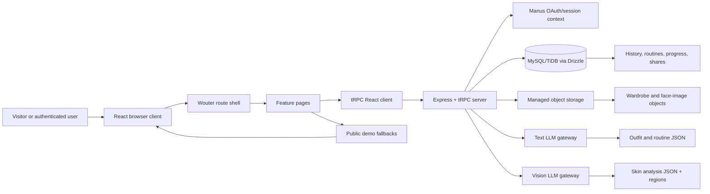

### Request boundary principles

The client is responsible for interaction, previews, file selection, loading states, and presentation. The server is responsible for authentication context, input validation, AI invocation, database writes, storage writes, ownership checks, and public share-token lookup.

> **Important:** A public browser route does not mean every backend operation is public. Anonymous visitors can browse and use the demo experience; protected mutations still reject unauthenticated calls.

## Repository Structure

```
closetai-skin/
├── client/
│   ├── index.html
│   ├── public/
│   │   └── robots.txt / small configuration files
│   └── src/
│       ├── App.tsx
│       ├── index.css
│       ├── main.tsx
│       ├── components/
│       │   ├── DashboardLayout.tsx
│       │   ├── AIChatBox.tsx
│       │   └── ui/
│       ├── contexts/
│       ├── lib/
│       │   ├── trpc.ts
│       │   └── guestFallbacks.ts
│       └── pages/
│           ├── Home.tsx
│           ├── SharePage.tsx
│           └── NotFound.tsx
├── drizzle/
│   ├── schema.ts
│   ├── relations.ts
│   └── migrations/
├── server/
│   ├── db.ts
│   ├── routers.ts
│   ├── storage.ts
│   ├── *_test.ts
│   └── _core/
│       ├── context.ts
│       ├── env.ts
│       ├── llm.ts
│       ├── storageProxy.ts
│       └── ...
├── shared/
│   ├── const.ts
│   └── types.ts
├── todo.md
├── package.json
└── README.md
```

### Important file responsibilities

| File | Responsibility |
| --- | --- |
| `client/src/App.tsx` | Route registration, theme provider, error boundary, and global UI providers. |
| `client/src/pages/Home.tsx` | Main dashboard, feature sections, demo mode, upload interactions, AI result presentation, progress tracker, sharing controls, and virtual try-on flow. |
| `client/src/pages/SharePage.tsx` | Public view-only rendering of a saved routine or outfit share token. |
| `client/src/lib/trpc.ts` | Typed React tRPC client binding. |
| `client/src/lib/guestFallbacks.ts` | Deterministic local fallback behavior for anonymous demo usage when protected queries are unavailable. |
| `server/routers.ts` | Public and protected tRPC procedures, structured AI contracts, ownership boundaries, and share resolution. |
| `server/db.ts` | Database connection and user-owned query/mutation helpers. |
| `server/storage.ts` | Managed storage upload helpers and file metadata handling. |
| `drizzle/schema.ts` | Database schema for users, wardrobe, profiles, analysis history, routines, progress, recommendations, and shares. |

## Technology Stack

| Layer | Technology | Role |
| --- | --- | --- |
| UI | React 19 | Component rendering and stateful user interaction. |
| Routing | Wouter | Lightweight client-side route registration. |
| Styling | Tailwind CSS 4 + custom CSS tokens | Responsive layout, soft-luxury visual system, focus states, and motion. |
| Components | shadcn-style Radix primitives | Accessible dialogs, buttons, cards, tabs, progress indicators, and tooltips. |
| API contract | tRPC 11 | End-to-end typed procedures between React and Express. |
| Server | Express 4 | Managed Node server and tRPC transport. |
| Database | Drizzle ORM + MySQL/TiDB | Relational persistence and typed queries. |
| Storage | Managed object storage / S3-compatible helpers | Wardrobe and face-image object storage. |
| AI | Manus built-in LLM and vision gateway | Structured text generation and image-aware skin analysis. |
| Charts | Recharts | Skin history and progress visualization. |
| Tests | Vitest | Unit, contract, boundary, security, and behavior tests. |
| Hosting | Manus WebDev Autoscale | Managed deployment with checkpoint-based publishing. |

## Local Development

### Prerequisites

Use Node.js compatible with the project toolchain, pnpm, and access to the required Manus environment variables. The managed Manus project supplies runtime values in development and production; do not commit a local `.env` file.

### Install dependencies

```bash
pnpm install
```

### Start the development server

```bash
pnpm dev
```

The project server chooses the managed runtime port. Do not hardcode a production port in application code.

### Typecheck

```bash
pnpm check
```

### Run tests

```bash
pnpm test
```

### Build production assets

```bash
pnpm build
```

### Format source files

```bash
pnpm format
```

### Database workflow

The schema-first workflow is:

```bash
pnpm drizzle-kit generate
```

Review the generated migration SQL before applying it. Apply migrations through the managed database workflow rather than destructive ad hoc commands. The existing project migrations are non-destructive table-creation migrations for the feature model.

## Environment Variables

The application uses managed environment variables supplied by the Manus project. The names below are architectural inputs; actual secret values must be configured through the project secret manager and must not be committed.

| Variable | Scope | Purpose |
| --- | --- | --- |
| `DATABASE_URL` | Server | MySQL/TiDB connection string. |
| `JWT_SECRET` | Server | Session cookie signing. |
| `VITE_APP_ID` | Client/server | Manus OAuth application identifier. |
| `OAUTH_SERVER_URL` | Server | OAuth backend base URL. |
| `VITE_OAUTH_PORTAL_URL` | Client | Login portal URL for optional authentication. |
| `BUILT_IN_FORGE_API_URL` | Server | Manus built-in API gateway. |
| `BUILT_IN_FORGE_API_KEY` | Server | Server-side gateway authorization. |
| `VITE_FRONTEND_FORGE_API_URL` | Client | Frontend-safe built-in API URL where applicable. |
| `VITE_FRONTEND_FORGE_API_KEY` | Client | Frontend-safe gateway key where applicable. |
| `VITE_ANALYTICS_ENDPOINT` | Client | Optional analytics endpoint. |
| `VITE_ANALYTICS_WEBSITE_ID` | Client | Optional analytics website identifier. |

### Secret handling rules

1. Never place an API key in `client/src`, `client/public`, README examples, screenshots, or demo records.

1. Never accept a client-supplied storage credential or storage bucket path as authoritative.

1. Validate user ownership on every protected read and write.

1. Treat uploaded images as sensitive personal data and keep object keys and metadata separate from public share content.

1. Use short-lived signed URLs or managed proxy behavior where private objects must be displayed.

---

## Application Navigation

The application uses the following exact primary sections:

| Section | Core experience |
| --- | --- |
| **Wardrobe** | Clothing uploads, tagging, gallery browsing, and wardrobe context. |
| **Outfits** | LLM-generated combinations based on wardrobe, weather, and occasion. |
| **Skin Analysis** | Face upload, structured vision analysis, overlays, scores, and next steps. |
| **My Skin Routine** | Morning/evening routine generation, check-ins, streaks, badges, and sharing. |
| **Skin Tone Studio** | Undertone and palette guidance that connects skin color context to wardrobe choices. |
| **Trends** | Seasonal style and beauty signals presented as exploratory inspiration. |

The **Virtual Try-On Studio** is available as a dedicated route from the outfit workflow and dashboard actions.

---

# Skincare AI Architecture

## Design goals

The skincare subsystem is designed as a wellness guidance experience rather than a medical diagnostic tool. Its technical goals are:

- Accept a face image through a controlled upload path.

- Produce a typed, bounded, structured result rather than unconstrained prose.

- Show the user which image regions informed a concern label when the model returns normalized regions.

- Keep the generated explanation aligned with numerical scores.

- Preserve a user-owned analysis history without storing raw image bytes in the relational database.

- Support public demo mode with clearly labeled illustrative data.

- Make failure states recoverable and visible instead of silently substituting a fake result.

## Skincare system diagram

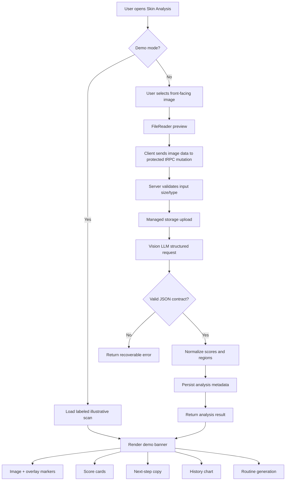

## Skin analysis request lifecycle

The full request lifecycle separates the user experience from the model call. The UI can show a preview immediately, but the result card only switches to a generated state after the validated response arrives.

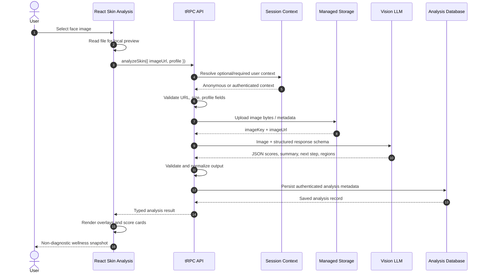

## Input contract

A minimal skin analysis request contains:

```
export type AnalyzeSkinInput = {
  imageUrl: string;
  profile: {
    skinType?: string;
    concerns?: string[];
    allergies?: string[];
    preferences?: string[];
  };
};
```

The current browser implementation uses a local file preview and sends the image representation through the server boundary. For a production hardening pass, large images should be uploaded directly to a short-lived managed upload endpoint, with the server receiving an object key rather than an oversized base64 body.

## Structured output contract

The analysis result is intentionally structured. A representative output contract is:

```
export type SkinAnalysisResult = {
  wellnessScore: number;
  hydration: number;
  texture: number;
  tone: number;
  pores: number;
  wrinkles: number;
  summary: string;
  nextStep: string;
  overlays: Array<{
    label: "hydration" | "texture" | "tone" | "pores" | "wrinkles";
    x: number;
    y: number;
    radius: number;
    severity: "low" | "moderate" | "high";
    note: string;
  }>;
};
```

### Contract invariants

| Field | Invariant |
| --- | --- |
| `wellnessScore` | Integer or bounded numeric score from 0 to 100. |
| `hydration`, `texture`, `tone`, `pores`, `wrinkles` | Numeric scores from 0 to 100. |
| `summary` | Short, non-diagnostic explanation suitable for a consumer UI. |
| `nextStep` | A conservative, actionable wellness suggestion. |
| `overlays[].x`, `overlays[].y` | Normalized coordinates in the range 0 to 1. |
| `overlays[].radius` | Normalized radius in a bounded range. |
| `overlays[].label` | One of the supported concern labels. |
| `overlays[].severity` | Controlled vocabulary, not free-form clinical grading. |

The server should reject malformed model output rather than rendering arbitrary content. The client should additionally clamp display coordinates and treat unknown labels as non-renderable.

## Score normalization

Model output is not a medical measurement. The application uses scores as explanatory UI indicators, not as clinical claims. A safe normalization layer should:

```
1. Parse JSON using the declared schema.
2. Convert numeric strings to numbers only if the conversion is unambiguous.
3. Clamp each score to [0, 100].
4. Clamp each region coordinate to [0, 1].
5. Discard regions with unknown labels or invalid coordinates.
6. Keep the original summary and next step only after string-length checks.
7. Persist the normalized result JSON, not the raw unvalidated model response.
```

## Vision prompt design

The server-side prompt should tell the model what it is allowed to do and what it must not claim. A suitable conceptual prompt includes:

```
You are providing a non-diagnostic cosmetic wellness snapshot.
Analyze only visible image-level cues. Do not diagnose disease, prescribe medication,
claim certainty, infer protected traits, or identify the person. Return only the
requested JSON fields. Use conservative language and normalized [0,1] overlay
coordinates for visible areas that correspond to the supported concern labels.
```

The prompt should be paired with a schema rather than relying on prose instructions alone. The application should treat model output as untrusted data and validate it at the server boundary.

---

# Visual Skin Concern Overlays

## Why overlays matter

A list of scores is abstract. An overlay lets a user connect a concern label to a visible area without requiring the user to understand the internals of the vision model. The overlay layer should remain explainable and modest: it highlights regions associated with the model response; it does not claim to prove a condition.

## Overlay coordinate system

Coordinates are normalized rather than stored in pixels. This makes the same analysis usable across responsive image sizes.

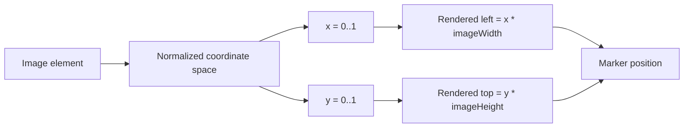

The browser applies the following conceptual transform:

```
const left = `${Math.max(0, Math.min(1, region.x)) * 100}%`;
const top = `${Math.max(0, Math.min(1, region.y)) * 100}%`;
const size = `${Math.max(3, Math.min(18, region.radius * 100))}%`;
```

## Rendering model

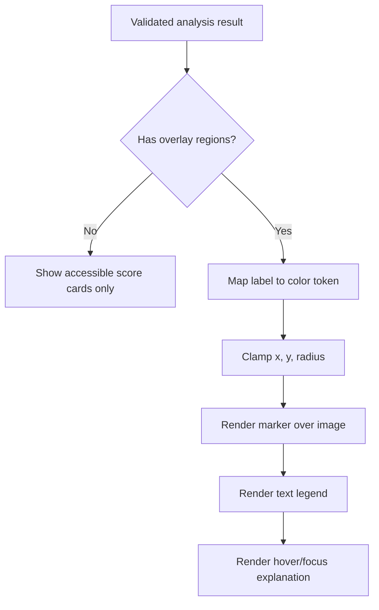

Recommended color tokens are semantic rather than diagnostic:

| Concern | Example visual token | UI meaning |
| --- | --- | --- |
| Hydration | Sage/green | Moisture-support focus. |
| Texture | Rose | Texture-smoothing focus. |
| Tone | Warm gold | Tone-evenness focus. |
| Pores | Periwinkle | Pore-visibility focus. |
| Wrinkles | Terracotta | Fine-line visibility focus. |

Every marker must have a text equivalent. The accessible legend should list the label, score or severity, and next-step note. The interface must not make the overlay the only way to understand the result.

## Demo overlays versus generated overlays

The application distinguishes between:

- **Demo overlays:** fixed illustrative points loaded only when Hackathon Demo Mode is active. The banner explicitly says the content is illustrative.

- **Generated overlays:** normalized regions returned by the validated vision response and persisted with the analysis result.

The demo layer must never be silently presented as a user-specific AI result.

---

# Skincare Routine Builder

## Routine generation flow

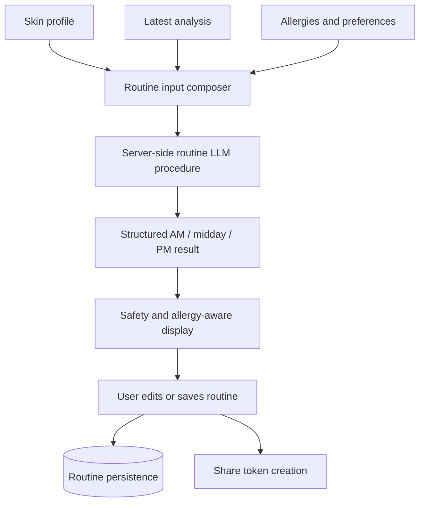

A routine item should include enough structure for the UI to render a step-by-step card:

```
export type RoutineStep = {
  timeOfDay: "morning" | "midday" | "evening";
  order: number;
  title: string;
  purpose: string;
  ingredientHighlights: string[];
  usage: string;
  caution?: string;
};
```

The generated routine UI uses four explicit states:

| State | User-facing behavior |
| --- | --- |
| Empty | Explains that a routine must be generated or loaded before steps appear. |
| Loading | Shows an in-progress state and disables duplicate generation. |
| Error | Explains that generation failed and exposes a retry path. |
| Generated | Shows actual steps, product guidance, completion controls, and sharing. |

Routine language should avoid overclaiming. It should not tell a user that a product will cure a disease, replace a clinician, or guarantee a result. It should frame recommendations as educational, preference-aware suggestions.

---

# Daily Progress, Streaks, and Badges

## Progress data flow

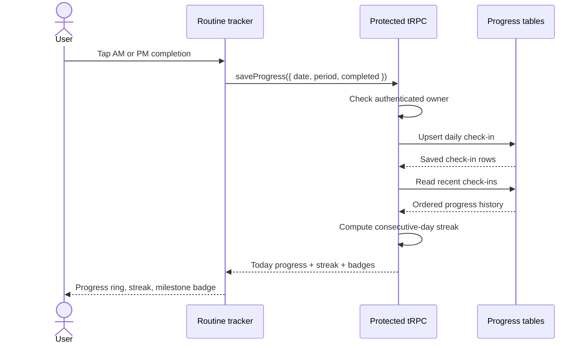

## Streak algorithm

The server is the source of truth. A client should not invent a streak from the current screen alone.

```
1. Load the user's completed routine dates in descending order.
2. Normalize each date to UTC calendar-day representation.
3. Start with the most recent completed day.
4. Walk backward one calendar day at a time.
5. Stop at the first missing day.
6. Return the number of consecutive completed dates.
7. Derive badges from explicit milestone thresholds.
```

Example badge thresholds:

| Streak | Badge |
| --- | --- |
| 1 day | First ritual |
| 3 days | Building a rhythm |
| 7 days | One-week glow |
| 14 days | Consistency editor |
| 30 days | Ritual regular |

Badges are motivational UI, not health claims. The user should be able to see what action produced the badge.

---

# Skin History and Trend Visualization

The history dashboard reads persisted analysis summaries and presents trends for hydration, texture, tone, and wellness score. The chart should expose a text summary for accessibility and should not imply that a short-term score change is clinically meaningful.

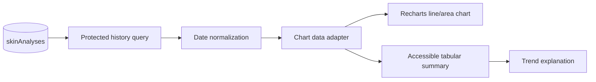

Chart preparation should be deterministic:

```
type SkinHistoryPoint = {
  date: string;
  hydration: number;
  texture: number;
  tone: number;
  wellnessScore: number;
};
```

The UI should handle empty history, loading, unauthorized access, and malformed records separately. In public demo mode, clearly labeled local demo rows can populate the chart without being written as real user history.

---

# Virtual Try-On Studio

## Product intent

The Virtual Try-On Studio provides a playful preview of how wardrobe pieces might work together on a personal image. The current feature is a **layered overlay studio**, not a full 3D body-aware or photorealistic image-transfer pipeline. That distinction should remain visible in product copy and future technical planning.

The studio supports:

- A user-selected or demo personal image.

- Garment selection from wardrobe records.

- Layered garment preview.

- Opacity adjustment.

- Preview reset.

- Save action for a composed look.

- Navigation back to outfit generation and wardrobe management.

## Virtual try-on architecture

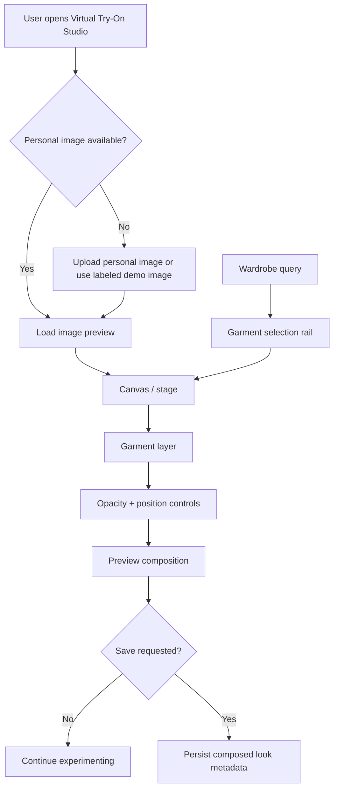

## Layered preview diagram

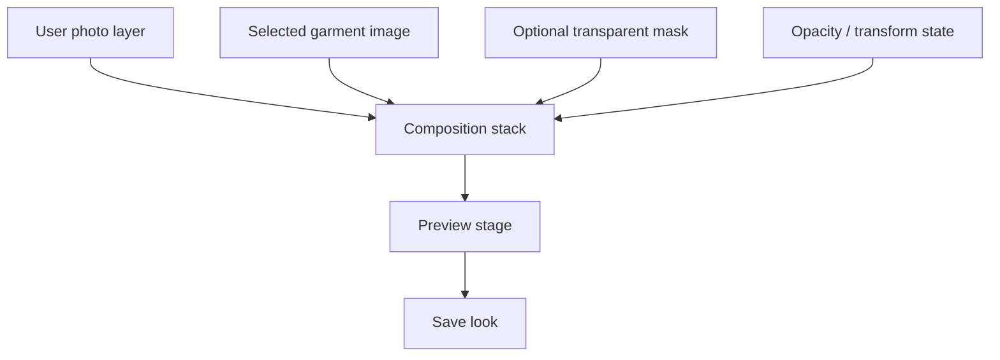

## Rendering model

A minimal browser implementation can represent the preview as a stack of absolutely positioned layers inside a constrained stage:

```tsx
<div className="relative aspect-[3/4] overflow-hidden rounded-3xl">
  
  
</div>
```

The current experience should avoid implying that the garment has been physically simulated. A future production-grade implementation could replace the overlay with a dedicated virtual try-on model or image-editing API, but that would require a separate image-processing pipeline, consent model, moderation layer, compute budget, and stronger visual-quality validation.

## Virtual try-on state machine

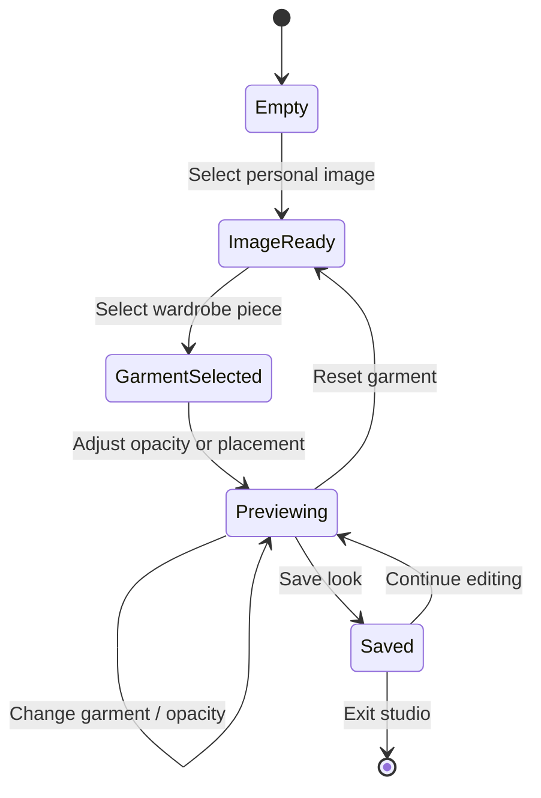

## Accessibility requirements

The studio should provide:

- An accessible name for the personal image stage.

- Text labels for garments rather than icon-only controls.

- Keyboard-reachable garment selection.

- A visible focus ring on opacity and save controls.

- A reset action that restores the initial composition.

- A non-visual summary describing the selected garment and opacity.

- A clear indication when a preview is illustrative or demo-only.

## Quality boundaries

Virtual try-on output can be sensitive to body image, identity, and self-perception. The UI should avoid evaluative language such as “fix,” “hide flaws,” or “ideal body.” It should describe the feature as a styling preview and let the user control or delete their uploaded image.

---

# Wardrobe and Outfit Intelligence

## Wardrobe ingestion flow

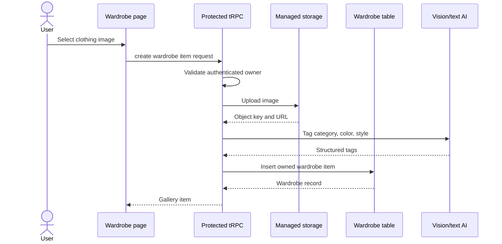

## Outfit generation flow

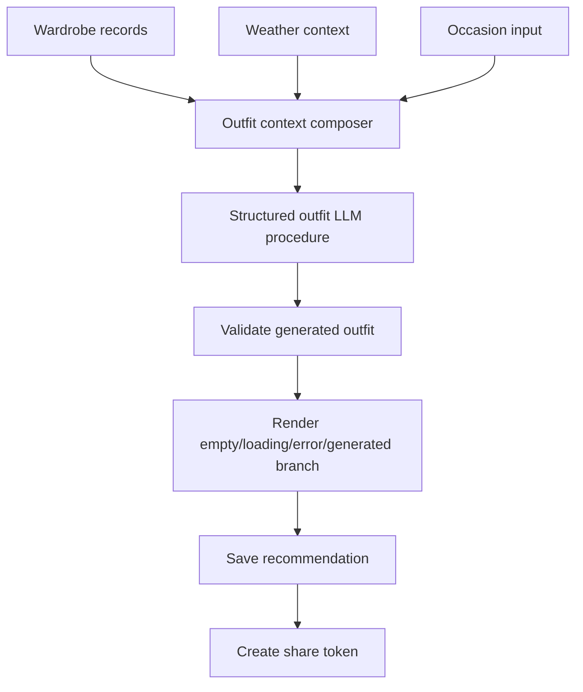

Generated outfit data should be represented as data, not just markdown, so the application can render it in a share page and maintain a stable contract:

```
export type OutfitRecommendation = {
  title: string;
  occasion: string;
  weather: string;
  matchScore: number;
  rationale: string;
  items: Array<{
    wardrobeItemId?: number;
    name: string;
    role: "base" | "layer" | "bottom" | "shoe" | "accessory";
    color: string;
  }>;
};
```

---

# Sharing Architecture

## Share flow

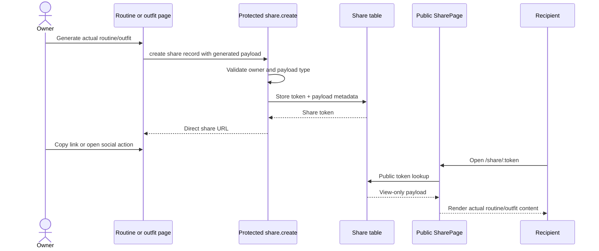

## Sharing safety rules

1. A share action is disabled until a real generated routine or outfit exists.

1. Generic fallback copy must never be published as if it were a user-generated result.

1. Share pages are view-only and do not expose account-management controls.

1. Private image objects should not be made public merely because a routine or outfit is shared.

1. A future production implementation should add expiration, revocation, and privacy settings.

## Social actions

The browser can support:

- Copy direct link.

- Native Web Share API where available.

- Facebook share URL action.

- Future additions for WhatsApp, Instagram-compatible workflows, or email.

Social sharing is a convenience layer; the server share record is the canonical payload source.

---

# Data Model

The project uses a relational model with user ownership and object-storage references. Image bytes belong in managed storage, not database columns.

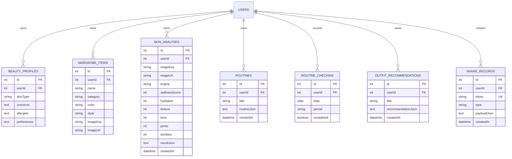

## Ownership invariant

Every user-owned table must be queried with the authenticated user identifier. A protected procedure should never accept an arbitrary `userId` from the browser as authority. The server derives the owner from the session context and uses client input only for feature-specific fields.

## Storage metadata invariant

For an image, store:

```
type StoredImageReference = {
  key: string;
  url: string;
  mimeType?: string;
  sizeBytes?: number;
};
```

Do not store the image bytes in MySQL/TiDB. The database stores the reference and ownership metadata; managed storage stores the actual object.

---

# tRPC Procedure Map

The exact procedure implementation may evolve, but the conceptual API surface is organized as follows:

| Router | Procedure | Access | Purpose |
| --- | --- | --- | --- |
| `auth` | `me` | Public | Read optional current user. |
| `auth` | `logout` | Public | Clear session cookie. |
| `ai` | `analyzeSkin` | Protected or demo-aware | Analyze uploaded face image and persist result when authenticated. |
| `ai` | `generateOutfit` | Protected or demo-aware | Generate structured outfit recommendation. |
| `ai` | `generateRoutine` | Protected or demo-aware | Generate structured skincare routine. |
| `ai` | `analyzeTone` | Protected or demo-aware | Generate undertone and palette result. |
| `wardrobe` | `list` | Protected | List owned wardrobe items. |
| `wardrobe` | `create` | Protected | Upload/store and create a wardrobe item. |
| `skinHistory` | `list` | Protected | List owned skin analysis records. |
| `progress` | `today` | Protected | Return today’s AM/PM progress and server streak. |
| `progress` | `save` | Protected | Upsert an AM/PM check-in. |
| `progress` | `list` | Protected | Return recent progress history. |
| `routines` | `save` | Protected | Persist a generated or edited routine. |
| `routines` | `list` | Protected | List owned routines. |
| `outfits` | `save` | Protected | Persist a generated outfit. |
| `outfits` | `list` | Protected | List owned outfit recommendations. |
| `shares` | `create` | Protected | Create a share token for actual generated content. |
| `shares` | `getByToken` | Public | Resolve a share token into view-only content. |

## Error behavior

The client should distinguish:

- `UNAUTHORIZED`: use public demo/fallback behavior where appropriate; do not attempt a protected mutation.

- `BAD_REQUEST`: show input correction guidance.

- `FORBIDDEN`: explain that the record is not accessible.

- `NOT_FOUND`: show an empty or expired-share state.

- `INTERNAL_SERVER_ERROR`: show a retryable error without exposing server internals.

---

# Authentication and Public Access

The application is intentionally accessible to everyone at the public route level. The navigation shell and demo skincare experience do not require Manus sign-in.

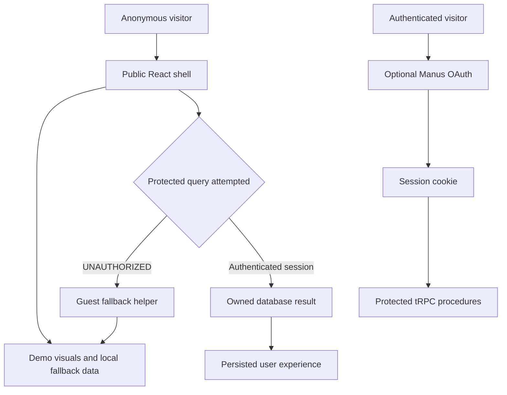

This split is important for the hackathon and for user trust. A visitor can understand the product without surrendering personal data. If the visitor chooses to upload a real image or save a routine, the application can explain when account persistence is required.

## Protected boundary checklist

- Keep `protectedProcedure` on user-owned database mutations.

- Reject anonymous calls to wardrobe creation, progress writes, and owned history queries.

- Use local deterministic fallback data only for presentation-safe demo surfaces.

- Never fabricate a database record for an anonymous user.

- Make the banner explicit: **No sign-in required** for browsing and demo use.

---

# Storage and Image Handling

## Image flow

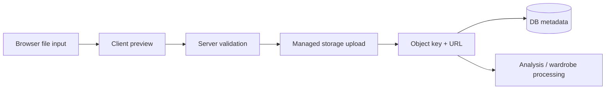

### Recommended validation

Before accepting an upload, validate:

| Check | Recommendation |
| --- | --- |
| MIME type | Allow only expected image MIME types. |
| File size | Enforce a server-side maximum. |
| Dimensions | Reject extremely small or unreasonably large images. |
| Ownership | Associate stored metadata with the authenticated user when persistence is requested. |
| Retention | Provide deletion or retention policy for real user images. |
| Exposure | Do not make private source images public through a share token. |

### Face-image considerations

Face images are sensitive. A production release should include a clear consent message, explain the purpose of processing, provide deletion controls, and avoid reusing images for training unless the user has explicitly agreed under a separate policy.

---

# Privacy, Safety, and Responsible AI

## Medical and cosmetic boundary

The application should describe itself as a skin wellness and routine-planning tool. It must not present the model as a dermatologist, diagnose a condition, prescribe medication, or imply certainty from a single image.

Recommended UI language:

> “This is a non-diagnostic wellness snapshot based on visible image cues. It is not medical advice.”

Avoid:

- “Your skin has disease X.”

- “This product will cure your condition.”

- “The model knows your health status.”

- “This is a medical grade score.”

## Image and identity safety

The model should be instructed not to infer protected traits or identity. The application should avoid demographic assumptions and should not use skin tone analysis to make judgments about a person’s identity, health, worth, or attractiveness.

## Product recommendation safety

Ingredient highlights are educational. Routine generation should account for declared allergies and preferences, but the system cannot guarantee ingredient safety without a complete product label and user-specific medical context. The interface should encourage patch testing and professional advice where appropriate, without becoming alarmist.

## Demo data policy

Hackathon demo records must be:

- Clearly labeled as illustrative.

- Separated from authenticated user records.

- Resettable through a demo reset control.

- Free of real-person identifying information.

- Free of fabricated testimonials, ratings, or customer reviews.

## Threat model summary

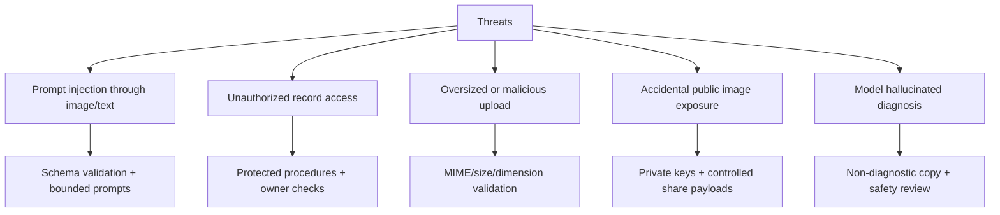

---

# Hackathon Demo Mode

Hackathon Demo Mode provides a reliable walkthrough when there is no authenticated user data or live AI response available. The demo mode uses generated visual assets, sample scores, sample concern markers, trend points, product still-life imagery, and AM/midday/PM routine steps.

## Demo state machine

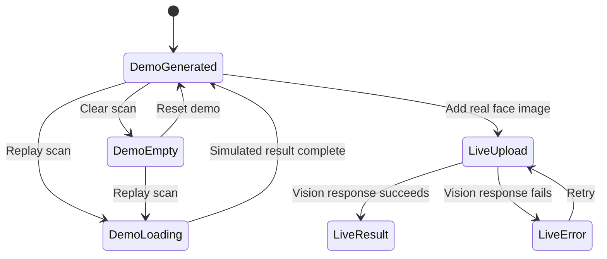

## Demo walkthrough

A reliable hackathon flow is:

1. Open the public application without signing in.

1. Select **Skin Analysis** in the sidebar.

1. Point out the **Hackathon Demo Mode** badge and the illustrative-content disclaimer.

1. Show the face image with color-coded hydration, tone, texture, and pore markers.

1. Explain that the markers are presentation visuals in demo mode.

1. Show the score cards and wellness summary.

1. Open the routine walkthrough and show AM, midday, and PM steps.

1. Click **Replay scan** to show a loading transition.

1. Click **Clear scan** to show the reachable empty state.

1. Click **Reset demo** to restore the complete demo presentation.

1. Move to Virtual Try-On Studio and layer a wardrobe item over a personal or demo image.

1. Generate an actual routine or outfit before demonstrating sharing.

---

# Testing Strategy

The project uses Vitest across several layers.

## Test layers

| Layer | Example responsibility |
| --- | --- |
| Contract tests | Verify AI schema keys, navigation labels, and structured response assumptions. |
| Security tests | Verify protected procedures reject anonymous callers. |
| Boundary tests | Verify progress and share procedure behavior with controlled dependencies. |
| Behavior tests | Verify guest fallback helpers use local data when protected queries return no data or UNAUTHORIZED-like errors. |
| Build checks | Verify TypeScript and production bundling. |
| Visual checks | Verify public overview, skincare demo, tracker, overlay, share, and mobile navigation layouts. |

## Existing quality gate

```bash
pnpm check
pnpm test
pnpm build
```

The completed release has a passing typecheck, **16 Vitest tests**, and a successful production build. Build output may report a chunk-size warning; this is a performance optimization opportunity rather than a compile failure.

## Recommended future tests

A production-quality extension should add browser-level tests for:

- Anonymous navigation to every public section.

- Upload rejection for unsupported file types.

- Progress check-in retry after a temporary network failure.

- Share-token not-found and revoked-token states.

- Overlay coordinate clamping and accessible legend synchronization.

- Virtual try-on keyboard navigation and reset behavior.

- Deletion of a stored face-image record.

---

# Deployment and Manus Publishing

The project is hosted through Manus WebDev. The project uses checkpoint-based publishing: a successful checkpoint saves the source state and publishes the release according to the project’s configured deployment behavior.

## Deployment flow

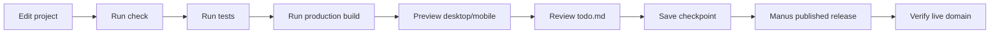

## Current published application

The current public application is available at:

[https://closetai-ski-gikppq9d.manus.space/](https://closetai-ski-gikppq9d.manus.space/)

The public skincare page is available at:

[https://closetai-ski-gikppq9d.manus.space/skin-analysis](https://closetai-ski-gikppq9d.manus.space/skin-analysis)

## Release checklist

Before publishing a future release:

1. Run `pnpm check`.

1. Run `pnpm test`.

1. Run `pnpm build`.

1. Capture desktop and mobile previews.

1. Confirm no secrets or dependencies are in any export archive.

1. Review `todo.md`.

1. Save a checkpoint.

1. Verify the live public domain.

---

# Troubleshooting

## The application shows a login wall

The public shell should not require authentication. Confirm that the dashboard layout does not redirect anonymous visitors and that protected query errors are routed through guest fallback helpers. Protected mutations may still correctly return `UNAUTHORIZED`.

## Skin analysis does not return a result

Check the browser error state, confirm the image is a supported type and size, and retry. In demo mode, use **Replay scan** or **Reset demo** to restore the illustrative result. Check server logs for AI gateway or storage errors without exposing request bodies or private image URLs.

## Overlays are missing

The overlay layer only renders validated model-returned regions in live mode or labeled demo regions in demo mode. If the result contains no valid regions, the score cards and accessible legend should remain available without markers.

## Routine sharing is disabled

Sharing requires a real generated routine or outfit payload. Generate the content first, then use the Share action. Generic empty-state copy is intentionally not shareable.

## Wardrobe data is missing for a guest

Anonymous visitors receive local demo wardrobe data when protected persistence is unavailable. To save a real wardrobe item, the visitor must use the authenticated persistence flow.

## Database migration mismatch

Compare `drizzle/schema.ts` with the generated migration files and the managed database state. Never use destructive reset commands against a database containing user data. Apply schema changes through the managed migration workflow.

## Build passes but bundle warning appears

The Vite build currently reports a large JavaScript chunk warning. Future optimization can use route-level dynamic imports or Rollup manual chunks. The warning does not indicate a failed build.

---

# Extension Roadmap

## Near-term product hardening

The next practical improvements are stronger browser-level tests, direct managed uploads for large images, explicit image deletion controls, revocable share tokens, and a profile editor that lets users review skin type, concerns, allergies, and preferences.

## Advanced skincare vision

A more advanced skincare system could add face-region segmentation, confidence estimates, lighting-quality checks, multi-image comparisons, and model-calibrated explanations. These additions should be evaluated with representative data and expert review rather than added solely for visual novelty.

## Advanced virtual try-on

A production virtual try-on engine could use body-aware garment segmentation, pose estimation, occlusion handling, garment deformation, and image-to-image synthesis. Such a pipeline would need a dedicated inference service, queueing or reserved compute, image moderation, latency budgets, and an explicit user-consent policy.

```mermaid
flowchart TD
    A[Current overlay studio] --> B[Garment segmentation]
    B --> C[Pose and body landmarks]
    C --> D[Occlusion reasoning]
    D --> E[Garment warping]
    E --> F[Image synthesis]
    F --> G[Quality and safety checks]
    G --> H[User-controlled preview]
```

## Product analytics

Future analytics should measure feature usefulness rather than appearance pressure. Appropriate metrics include completion of a routine step, successful upload, time to first useful result, share-link creation, retry rates, and opt-in return usage. Avoid optimizing for repeated body checking or anxiety-inducing engagement loops.

---

# References

[1]: https://trpc.io/docs "tRPC Documentation"

[2]: https://orm.drizzle.team/docs/overview "Drizzle ORM Documentation"

[3]: https://vitest.dev/guide/ "Vitest Guide"

[4]: https://recharts.org/en-US/ "Recharts Documentation"

[5]: https://developer.mozilla.org/en-US/docs/Web/API/Web_Share_API "MDN Web Share API"

[6]: https://www.w3.org/WAI/standards-guidelines/wcag/ "W3C Web Content Accessibility Guidelines"

[7]: https://owasp.org/www-project-application-security-verification-standard/ "OWASP Application Security Verification Standard"

[8]: https://yce.perfectcorp.com/ai-api/products/skin-analysis-api "Perfect Corp YouCam Skin Analysis API reference"

[9]: https://www.nist.gov/itl/ai-risk-management-framework "NIST AI Risk Management Framework"

[10]: https://mermaid.js.org/intro/ "Mermaid Diagram Syntax"

[11]: https://vite.dev/guide/ "Vite Documentation"

[12]: https://react.dev/learn "React Documentation"

---
